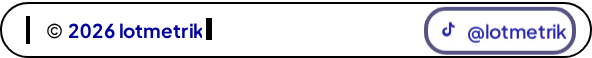
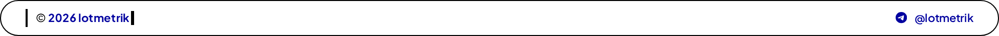
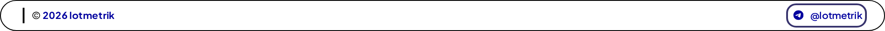
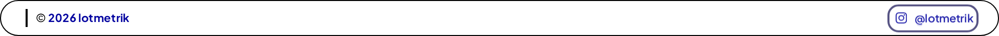
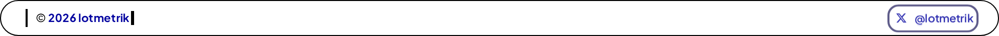

# Visual + a11y report

- Scenarios: 15
- Checks: 70
- Failures: **0**

## xs-320

| Status | Check | Detail | Screenshot |
| --- | --- | --- | --- |
| ✅ pass | header render (320px) | h=57.0px |  |
| ✅ pass | footer render (320px) | h=28.0px |  |

## android-360

| Status | Check | Detail | Screenshot |
| --- | --- | --- | --- |
| ✅ pass | header render (360px) | h=57.0px |  |
| ✅ pass | footer render (360px) | h=30.0px |  |

## iphone-375

| Status | Check | Detail | Screenshot |
| --- | --- | --- | --- |
| ✅ pass | header render (375px) | h=57.0px |  |
| ✅ pass | footer render (375px) | h=30.0px |  |

## iphone-390

| Status | Check | Detail | Screenshot |
| --- | --- | --- | --- |
| ✅ pass | header render (390px) | h=57.0px |  |
| ✅ pass | footer render (390px) | h=30.0px |  |

## android-411

| Status | Check | Detail | Screenshot |
| --- | --- | --- | --- |
| ✅ pass | header render (411px) | h=57.0px |  |
| ✅ pass | footer render (411px) | h=30.0px |  |

## tablet-768

| Status | Check | Detail | Screenshot |
| --- | --- | --- | --- |
| ✅ pass | header render (768px) | h=65.0px |  |
| ✅ pass | footer render (768px) | h=36.0px |  |

## desktop-1280

| Status | Check | Detail | Screenshot |
| --- | --- | --- | --- |
| ✅ pass | header render (1280px) | h=65.0px |  |
| ✅ pass | footer render (1280px) | h=36.0px |  |

## hc-320-light

| Status | Check | Detail | Screenshot |
| --- | --- | --- | --- |
| ✅ pass | footer no-wrap | h=28.0px cap=56px |  |
| ✅ pass | footer landmark | label=Site footer role=contentinfo (implicit) | — |
| ✅ pass | no stray headings in header/footer | 0 headings | — |
| ✅ pass | rotator link 0 (Telegram) focus ring | outline=2px solid rgba(5, 0, 73, 0.8) |  |
| ✅ pass | rotator link 1 (Instagram) focus ring | outline=2px solid rgba(5, 0, 73, 0.8) |  |
| ✅ pass | rotator link 2 (TikTok) focus ring | outline=2px solid rgba(5, 0, 73, 0.8) |  |
| ✅ pass | rotator link 3 (X) focus ring | outline=2px solid rgba(5, 0, 73, 0.8) |  |

## hc-320-dark

| Status | Check | Detail | Screenshot |
| --- | --- | --- | --- |
| ✅ pass | footer no-wrap | h=28.0px cap=56px |  |
| ✅ pass | footer landmark | label=Site footer role=contentinfo (implicit) | — |
| ✅ pass | no stray headings in header/footer | 0 headings | — |
| ✅ pass | rotator link 0 (Telegram) focus ring | outline=2px solid rgba(0, 230, 255, 0.8) |  |
| ✅ pass | rotator link 1 (Instagram) focus ring | outline=2px solid rgba(0, 230, 255, 0.8) |  |
| ✅ pass | rotator link 2 (TikTok) focus ring | outline=2px solid rgba(0, 230, 255, 0.8) |  |
| ✅ pass | rotator link 3 (X) focus ring | outline=2px solid rgba(0, 230, 255, 0.8) |  |

## hc-1280-light

| Status | Check | Detail | Screenshot |
| --- | --- | --- | --- |
| ✅ pass | footer no-wrap | h=36.0px cap=56px |  |
| ✅ pass | footer landmark | label=Site footer role=contentinfo (implicit) | — |
| ✅ pass | no stray headings in header/footer | 0 headings | — |
| ✅ pass | rotator link 0 (Telegram) focus ring | outline=2px solid rgba(5, 0, 73, 0.8) |  |
| ✅ pass | rotator link 1 (Instagram) focus ring | outline=2px solid rgba(5, 0, 73, 0.8) |  |
| ✅ pass | rotator link 2 (TikTok) focus ring | outline=2px solid rgba(5, 0, 73, 0.8) |  |
| ✅ pass | rotator link 3 (X) focus ring | outline=2px solid rgba(5, 0, 73, 0.8) |  |

## hc-1280-dark

| Status | Check | Detail | Screenshot |
| --- | --- | --- | --- |
| ✅ pass | footer no-wrap | h=36.0px cap=56px |  |
| ✅ pass | footer landmark | label=Site footer role=contentinfo (implicit) | — |
| ✅ pass | no stray headings in header/footer | 0 headings | — |
| ✅ pass | rotator link 0 (Telegram) focus ring | outline=2px solid rgba(0, 230, 255, 0.8) |  |
| ✅ pass | rotator link 1 (Instagram) focus ring | outline=2px solid rgba(0, 230, 255, 0.8) |  |
| ✅ pass | rotator link 2 (TikTok) focus ring | outline=2px solid rgba(0, 230, 255, 0.8) |  |
| ✅ pass | rotator link 3 (X) focus ring | outline=2px solid rgba(0, 230, 255, 0.8) |  |

## zoom200-320-light

| Status | Check | Detail | Screenshot |
| --- | --- | --- | --- |
| ✅ pass | footer no-wrap | h=56.0px cap=80px |  |
| ✅ pass | footer landmark | label=Site footer role=contentinfo (implicit) | — |
| ✅ pass | no stray headings in header/footer | 0 headings | — |
| ✅ pass | rotator link 0 (Telegram) focus ring | outline=2px solid lab(40.8095 37.8154 -77.4036) |  |
| ✅ pass | rotator link 1 (Instagram) focus ring | outline=2px solid lab(40.8095 37.8154 -77.4036) |  |
| ✅ pass | rotator link 2 (TikTok) focus ring | outline=2px solid lab(40.8095 37.8154 -77.4036) |  |
| ✅ pass | rotator link 3 (X) focus ring | outline=2px solid lab(40.8095 37.8154 -77.4036) |  |

## zoom200-320-dark

| Status | Check | Detail | Screenshot |
| --- | --- | --- | --- |
| ✅ pass | footer no-wrap | h=56.0px cap=80px |  |
| ✅ pass | footer landmark | label=Site footer role=contentinfo (implicit) | — |
| ✅ pass | no stray headings in header/footer | 0 headings | — |
| ✅ pass | rotator link 0 (Telegram) focus ring | outline=2px solid lab(40.8095 37.8154 -77.4036) |  |
| ✅ pass | rotator link 1 (Instagram) focus ring | outline=2px solid lab(40.8095 37.8154 -77.4036) |  |
| ✅ pass | rotator link 2 (TikTok) focus ring | outline=2px solid lab(40.8095 37.8154 -77.4036) |  |
| ✅ pass | rotator link 3 (X) focus ring | outline=2px solid lab(40.8095 37.8154 -77.4036) |  |

## zoom200-1280-light

| Status | Check | Detail | Screenshot |
| --- | --- | --- | --- |
| ✅ pass | footer no-wrap | h=72.0px cap=80px |  |
| ✅ pass | footer landmark | label=Site footer role=contentinfo (implicit) | — |
| ✅ pass | no stray headings in header/footer | 0 headings | — |
| ✅ pass | rotator link 0 (Telegram) focus ring | outline=2px solid lab(40.8095 37.8154 -77.4036) |  |
| ✅ pass | rotator link 1 (Instagram) focus ring | outline=2px solid lab(40.8095 37.8154 -77.4036) |  |
| ✅ pass | rotator link 2 (TikTok) focus ring | outline=2px solid lab(40.8095 37.8154 -77.4036) |  |
| ✅ pass | rotator link 3 (X) focus ring | outline=2px solid lab(40.8095 37.8154 -77.4036) |  |

## zoom200-1280-dark

| Status | Check | Detail | Screenshot |
| --- | --- | --- | --- |
| ✅ pass | footer no-wrap | h=72.0px cap=80px |  |
| ✅ pass | footer landmark | label=Site footer role=contentinfo (implicit) | — |
| ✅ pass | no stray headings in header/footer | 0 headings | — |
| ✅ pass | rotator link 0 (Telegram) focus ring | outline=2px solid lab(57.5271 32.4997 -77.3903) |  |
| ✅ pass | rotator link 1 (Instagram) focus ring | outline=2px solid lab(40.8095 37.8154 -77.4036) |  |
| ✅ pass | rotator link 2 (TikTok) focus ring | outline=2px solid lab(40.8095 37.8154 -77.4036) |  |
| ✅ pass | rotator link 3 (X) focus ring | outline=2px solid lab(40.8095 37.8154 -77.4036) |  |
