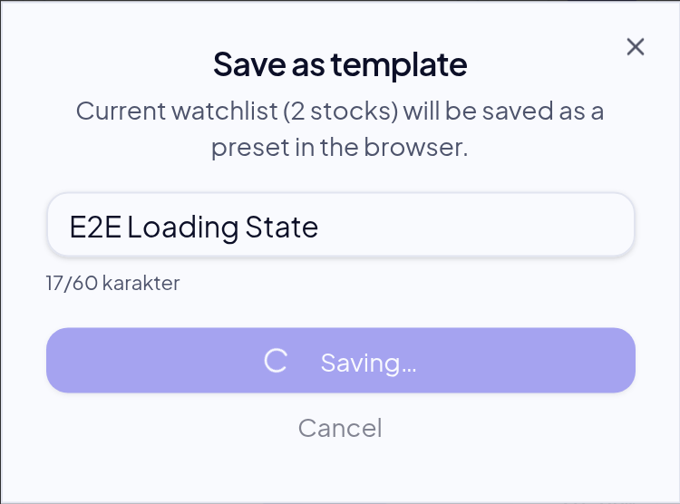
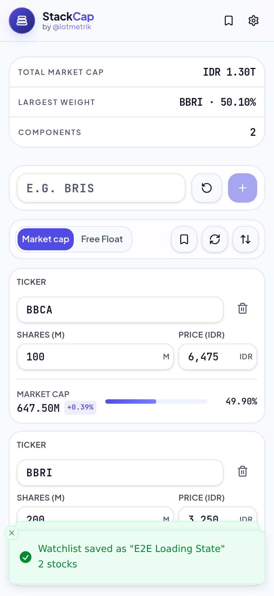
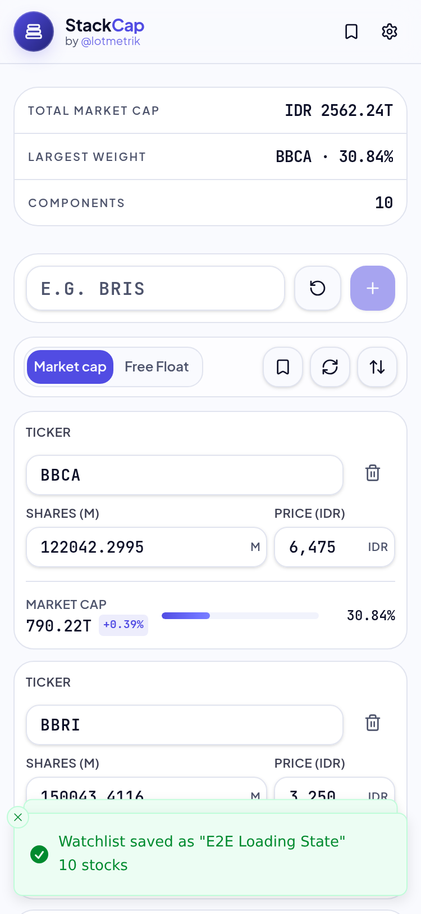
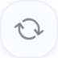
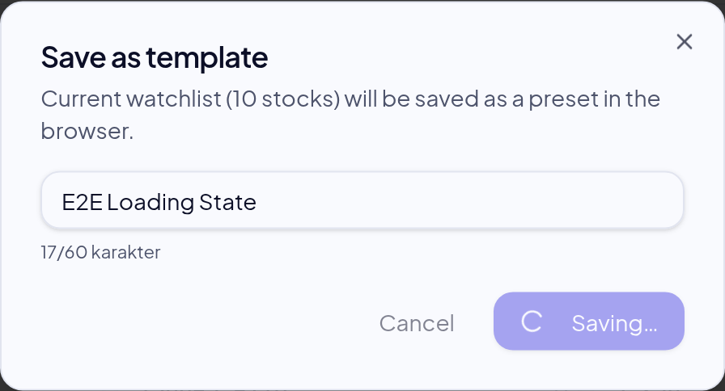
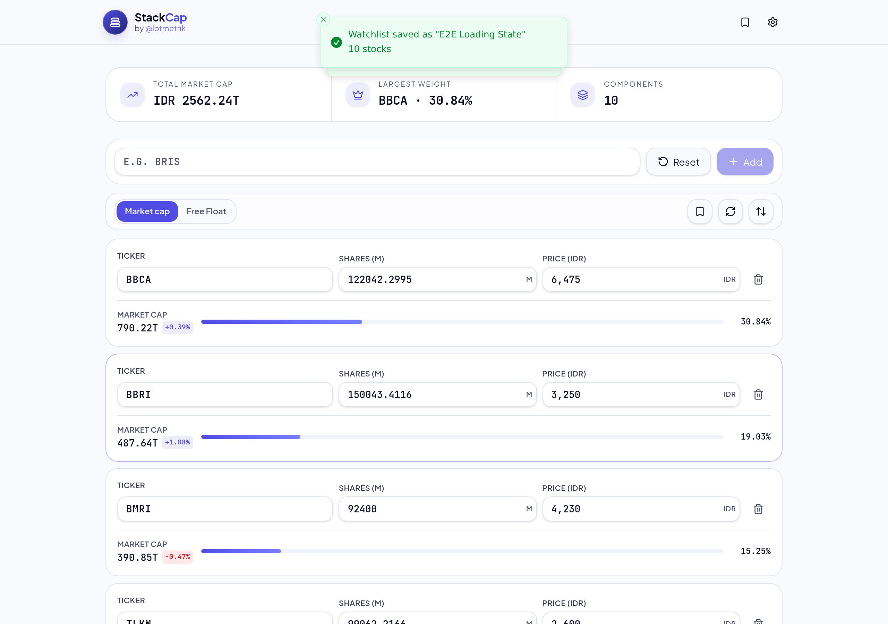

# Button loading state E2E

## mobile-light — PASS

- ✅ Refresh idle: enabled
- ✅ Refresh idle: no aria-busy
- ✅ Refresh shows aria-busy=true while loading
- ✅ Refresh is disabled while loading
- ✅ Refresh icon spins while loading — svg.animate-spin=1
- ✅ Double click while busy does not fire a 2nd quote request — calls=2 (was 2)
- ✅ Refresh returns to normal after load
- ✅ Refresh spinner removed after load
- ✅ Save dialog opens
- ✅ Dialog Save idle: no aria-busy
- ✅ Dialog Save shows busy state (Saving…)
- ✅ Busy label reads Saving… — Saving…
- ✅ Dialog Save disabled while saving
- ✅ Dialog closes after save completes
- ✅ Exactly one template saved (no double submit) — count=1
- ✅ Success toast shown — Watchlist saved as "E2E Loading State"
2 stocks

## mobile-dark — PASS

- ✅ Refresh idle: enabled
- ✅ Refresh idle: no aria-busy
- ✅ Refresh shows aria-busy=true while loading
- ✅ Refresh is disabled while loading
- ✅ Refresh icon spins while loading — svg.animate-spin=1
- ✅ Double click while busy does not fire a 2nd quote request — calls=10 (was 10)
- ✅ Refresh returns to normal after load
- ✅ Refresh spinner removed after load
- ✅ Save dialog opens
- ✅ Dialog Save idle: no aria-busy
- ✅ Dialog Save shows busy state (Saving…)
- ✅ Busy label reads Saving… — Saving…
- ✅ Dialog Save disabled while saving
- ✅ Dialog closes after save completes
- ✅ Exactly one template saved (no double submit) — count=1
- ✅ Success toast shown — Watchlist saved as "E2E Loading State"
10 stocks

## desktop-light — PASS

- ✅ Refresh idle: enabled
- ✅ Refresh idle: no aria-busy
- ✅ Refresh shows aria-busy=true while loading
- ✅ Refresh is disabled while loading
- ✅ Refresh icon spins while loading — svg.animate-spin=1
- ✅ Double click while busy does not fire a 2nd quote request — calls=10 (was 10)
- ✅ Refresh returns to normal after load
- ✅ Refresh spinner removed after load
- ✅ Save dialog opens
- ✅ Dialog Save idle: no aria-busy
- ✅ Dialog Save shows busy state (Saving…)
- ✅ Busy label reads Saving… — Saving…
- ✅ Dialog Save disabled while saving
- ✅ Dialog closes after save completes
- ✅ Exactly one template saved (no double submit) — count=1
- ✅ Success toast shown — Watchlist saved as "E2E Loading State"
10 stocks

