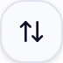
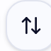
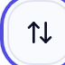

# Focus ring — mobile visual/assertion E2E

- Scenarios: 3
- Failing scenarios: **0**

Each icon button is checked blurred, on keyboard Tab focus, and after a touch pointerdown.

## mobile-light ✅

| Check | Status | Detail |
| --- | --- | --- |
| save: button visible | ✅ | — |
| save: reachable via Tab | ✅ | — |
| save: :focus-visible active on Tab | ✅ | {"outlineWidth":"0px","outlineStyle":"none","outlineColor":"rgb(229, 151, 0)","boxShadow":"rgba(0, 0, 0, 0) 0px 0px 0px  |
| save: focus ring visible on Tab | ✅ | outline=0px none shadow=rgba(0, 0, 0, 0) 0px 0px 0px 0px, rgba(0, 0, 0, 0) 0px 0px 0 |
| save: focused after tap | ✅ | {"outlineWidth":"0px","outlineStyle":"none","outlineColor":"rgb(229, 151, 0)","boxShadow":"rgba(0, 0, 0, 0) 0px 0px 0px  |
| save: focus ring visible on tap | ✅ | outline=0px none shadow=rgba(0, 0, 0, 0) 0px 0px 0px 0px, rgba(0, 0, 0, 0) 0px 0px 0 |
| refresh: button visible | ✅ | — |
| refresh: reachable via Tab | ✅ | — |
| refresh: :focus-visible active on Tab | ✅ | {"outlineWidth":"0px","outlineStyle":"none","outlineColor":"rgb(229, 151, 0)","boxShadow":"rgba(0, 0, 0, 0) 0px 0px 0px  |
| refresh: focus ring visible on Tab | ✅ | outline=0px none shadow=rgba(0, 0, 0, 0) 0px 0px 0px 0px, rgba(0, 0, 0, 0) 0px 0px 0 |
| refresh: focused after tap | ✅ | {"outlineWidth":"0px","outlineStyle":"none","outlineColor":"rgb(229, 151, 0)","boxShadow":"rgba(0, 0, 0, 0) 0px 0px 0px  |
| refresh: focus ring visible on tap | ✅ | outline=0px none shadow=rgba(0, 0, 0, 0) 0px 0px 0px 0px, rgba(0, 0, 0, 0) 0px 0px 0 |
| sort: button visible | ✅ | — |
| sort: reachable via Tab | ✅ | — |
| sort: :focus-visible active on Tab | ✅ | {"outlineWidth":"0px","outlineStyle":"none","outlineColor":"rgb(229, 151, 0)","boxShadow":"rgba(0, 0, 0, 0) 0px 0px 0px  |
| sort: focus ring visible on Tab | ✅ | outline=0px none shadow=rgba(0, 0, 0, 0) 0px 0px 0px 0px, rgba(0, 0, 0, 0) 0px 0px 0 |

- save blur: 
- save tab: 
- save tap: 
- refresh blur: 
- refresh tab: 
- refresh tap: 
- sort blur: 
- sort tab: 

## mobile-dark ✅

| Check | Status | Detail |
| --- | --- | --- |
| save: button visible | ✅ | — |
| save: reachable via Tab | ✅ | — |
| save: :focus-visible active on Tab | ✅ | {"outlineWidth":"0px","outlineStyle":"none","outlineColor":"rgb(229, 151, 0)","boxShadow":"rgba(0, 0, 0, 0) 0px 0px 0px  |
| save: focus ring visible on Tab | ✅ | outline=0px none shadow=rgba(0, 0, 0, 0) 0px 0px 0px 0px, rgba(0, 0, 0, 0) 0px 0px 0 |
| save: focused after tap | ✅ | {"outlineWidth":"0px","outlineStyle":"none","outlineColor":"rgb(229, 151, 0)","boxShadow":"rgba(0, 0, 0, 0) 0px 0px 0px  |
| save: focus ring visible on tap | ✅ | outline=0px none shadow=rgba(0, 0, 0, 0) 0px 0px 0px 0px, rgba(0, 0, 0, 0) 0px 0px 0 |
| refresh: button visible | ✅ | — |
| refresh: reachable via Tab | ✅ | — |
| refresh: :focus-visible active on Tab | ✅ | {"outlineWidth":"0px","outlineStyle":"none","outlineColor":"rgb(229, 151, 0)","boxShadow":"rgba(0, 0, 0, 0) 0px 0px 0px  |
| refresh: focus ring visible on Tab | ✅ | outline=0px none shadow=rgba(0, 0, 0, 0) 0px 0px 0px 0px, rgba(0, 0, 0, 0) 0px 0px 0 |
| refresh: focused after tap | ✅ | {"outlineWidth":"0px","outlineStyle":"none","outlineColor":"rgb(229, 151, 0)","boxShadow":"rgba(0, 0, 0, 0) 0px 0px 0px  |
| refresh: focus ring visible on tap | ✅ | outline=0px none shadow=rgba(0, 0, 0, 0) 0px 0px 0px 0px, rgba(0, 0, 0, 0) 0px 0px 0 |
| sort: button visible | ✅ | — |
| sort: reachable via Tab | ✅ | — |
| sort: :focus-visible active on Tab | ✅ | {"outlineWidth":"0px","outlineStyle":"none","outlineColor":"rgb(229, 151, 0)","boxShadow":"rgba(0, 0, 0, 0) 0px 0px 0px  |
| sort: focus ring visible on Tab | ✅ | outline=0px none shadow=rgba(0, 0, 0, 0) 0px 0px 0px 0px, rgba(0, 0, 0, 0) 0px 0px 0 |

- save blur: 
- save tab: 
- save tap: 
- refresh blur: 
- refresh tab: 
- refresh tap: 
- sort blur: 
- sort tab: 

## mobile-xs-light ✅

| Check | Status | Detail |
| --- | --- | --- |
| save: button visible | ✅ | — |
| save: reachable via Tab | ✅ | — |
| save: :focus-visible active on Tab | ✅ | {"outlineWidth":"0px","outlineStyle":"none","outlineColor":"rgb(229, 151, 0)","boxShadow":"rgba(0, 0, 0, 0) 0px 0px 0px  |
| save: focus ring visible on Tab | ✅ | outline=0px none shadow=rgba(0, 0, 0, 0) 0px 0px 0px 0px, rgba(0, 0, 0, 0) 0px 0px 0 |
| save: focused after tap | ✅ | {"outlineWidth":"0px","outlineStyle":"none","outlineColor":"rgb(229, 151, 0)","boxShadow":"rgba(0, 0, 0, 0) 0px 0px 0px  |
| save: focus ring visible on tap | ✅ | outline=0px none shadow=rgba(0, 0, 0, 0) 0px 0px 0px 0px, rgba(0, 0, 0, 0) 0px 0px 0 |
| refresh: button visible | ✅ | — |
| refresh: reachable via Tab | ✅ | — |
| refresh: :focus-visible active on Tab | ✅ | {"outlineWidth":"0px","outlineStyle":"none","outlineColor":"rgb(229, 151, 0)","boxShadow":"rgba(0, 0, 0, 0) 0px 0px 0px  |
| refresh: focus ring visible on Tab | ✅ | outline=0px none shadow=rgba(0, 0, 0, 0) 0px 0px 0px 0px, rgba(0, 0, 0, 0) 0px 0px 0 |
| refresh: focused after tap | ✅ | {"outlineWidth":"0px","outlineStyle":"none","outlineColor":"rgb(229, 151, 0)","boxShadow":"rgba(0, 0, 0, 0) 0px 0px 0px  |
| refresh: focus ring visible on tap | ✅ | outline=0px none shadow=rgba(0, 0, 0, 0) 0px 0px 0px 0px, rgba(0, 0, 0, 0) 0px 0px 0 |
| sort: button visible | ✅ | — |
| sort: reachable via Tab | ✅ | — |
| sort: :focus-visible active on Tab | ✅ | {"outlineWidth":"0px","outlineStyle":"none","outlineColor":"rgb(229, 151, 0)","boxShadow":"rgba(0, 0, 0, 0) 0px 0px 0px  |
| sort: focus ring visible on Tab | ✅ | outline=0px none shadow=rgba(0, 0, 0, 0) 0px 0px 0px 0px, rgba(0, 0, 0, 0) 0px 0px 0 |

- save blur: 
- save tab: 
- save tap: 
- refresh blur: 
- refresh tab: 
- refresh tap: 
- sort blur: 
- sort tab: 
