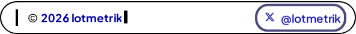
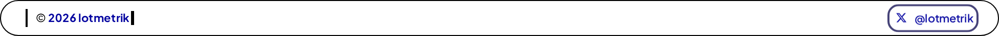

# Rotator keyboard E2E

- Scenarios: 8
- Failing scenarios: **0**

Each step verifies `.afd-item.active` and `document.activeElement`
point to the same rotator index after the keypress.

## hc-320-light ✅

Start idx: 0 · Links: 4

| Step | active | focused | sync |
| --- | --- | --- | --- |
| ArrowRight×1 | 1 | 1 | ✅ |
| ArrowRight×2 | 2 | 2 | ✅ |
| ArrowRight×3 | 3 | 3 | ✅ |
| ArrowRight×4 | 0 | 0 | ✅ |
| ArrowLeft×1 | 3 | 3 | ✅ |
| ArrowLeft×2 | 2 | 2 | ✅ |
| ArrowLeft×3 | 1 | 1 | ✅ |
| ArrowLeft×4 | 0 | 0 | ✅ |
| Home | 0 | 0 | ✅ |
| End | 3 | 3 | ✅ |
| ArrowDown | 0 | 0 | ✅ |
| ArrowUp | 3 | 3 | ✅ |

## hc-320-dark ✅

Start idx: 0 · Links: 4

| Step | active | focused | sync |
| --- | --- | --- | --- |
| ArrowRight×1 | 1 | 1 | ✅ |
| ArrowRight×2 | 2 | 2 | ✅ |
| ArrowRight×3 | 3 | 3 | ✅ |
| ArrowRight×4 | 0 | 0 | ✅ |
| ArrowLeft×1 | 3 | 3 | ✅ |
| ArrowLeft×2 | 2 | 2 | ✅ |
| ArrowLeft×3 | 1 | 1 | ✅ |
| ArrowLeft×4 | 0 | 0 | ✅ |
| Home | 0 | 0 | ✅ |
| End | 3 | 3 | ✅ |
| ArrowDown | 0 | 0 | ✅ |
| ArrowUp | 3 | 3 | ✅ |

## hc-1280-light ✅

Start idx: 0 · Links: 4

| Step | active | focused | sync |
| --- | --- | --- | --- |
| ArrowRight×1 | 1 | 1 | ✅ |
| ArrowRight×2 | 2 | 2 | ✅ |
| ArrowRight×3 | 3 | 3 | ✅ |
| ArrowRight×4 | 0 | 0 | ✅ |
| ArrowLeft×1 | 3 | 3 | ✅ |
| ArrowLeft×2 | 2 | 2 | ✅ |
| ArrowLeft×3 | 1 | 1 | ✅ |
| ArrowLeft×4 | 0 | 0 | ✅ |
| Home | 0 | 0 | ✅ |
| End | 3 | 3 | ✅ |
| ArrowDown | 0 | 0 | ✅ |
| ArrowUp | 3 | 3 | ✅ |

## hc-1280-dark ✅

Start idx: 0 · Links: 4

| Step | active | focused | sync |
| --- | --- | --- | --- |
| ArrowRight×1 | 1 | 1 | ✅ |
| ArrowRight×2 | 2 | 2 | ✅ |
| ArrowRight×3 | 3 | 3 | ✅ |
| ArrowRight×4 | 0 | 0 | ✅ |
| ArrowLeft×1 | 3 | 3 | ✅ |
| ArrowLeft×2 | 2 | 2 | ✅ |
| ArrowLeft×3 | 1 | 1 | ✅ |
| ArrowLeft×4 | 0 | 0 | ✅ |
| Home | 0 | 0 | ✅ |
| End | 3 | 3 | ✅ |
| ArrowDown | 0 | 0 | ✅ |
| ArrowUp | 3 | 3 | ✅ |

## zoom200-320-light ✅

Start idx: 0 · Links: 4

| Step | active | focused | sync |
| --- | --- | --- | --- |
| ArrowRight×1 | 0 | 0 | ✅ |
| ArrowRight×2 | 1 | 1 | ✅ |
| ArrowRight×3 | 2 | 2 | ✅ |
| ArrowRight×4 | 3 | 3 | ✅ |
| ArrowLeft×1 | 2 | 2 | ✅ |
| ArrowLeft×2 | 1 | 1 | ✅ |
| ArrowLeft×3 | 0 | 0 | ✅ |
| ArrowLeft×4 | 3 | 3 | ✅ |
| Home | 0 | 0 | ✅ |
| End | 3 | 3 | ✅ |
| ArrowDown | 0 | 0 | ✅ |
| ArrowUp | 3 | 3 | ✅ |

## zoom200-320-dark ✅

Start idx: 0 · Links: 4

| Step | active | focused | sync |
| --- | --- | --- | --- |
| ArrowRight×1 | 1 | 1 | ✅ |
| ArrowRight×2 | 2 | 2 | ✅ |
| ArrowRight×3 | 3 | 3 | ✅ |
| ArrowRight×4 | 0 | 0 | ✅ |
| ArrowLeft×1 | 3 | 3 | ✅ |
| ArrowLeft×2 | 2 | 2 | ✅ |
| ArrowLeft×3 | 1 | 1 | ✅ |
| ArrowLeft×4 | 0 | 0 | ✅ |
| Home | 0 | 0 | ✅ |
| End | 3 | 3 | ✅ |
| ArrowDown | 0 | 0 | ✅ |
| ArrowUp | 3 | 3 | ✅ |

## zoom200-1280-light ✅

Start idx: 0 · Links: 4

| Step | active | focused | sync |
| --- | --- | --- | --- |
| ArrowRight×1 | 1 | 1 | ✅ |
| ArrowRight×2 | 2 | 2 | ✅ |
| ArrowRight×3 | 3 | 3 | ✅ |
| ArrowRight×4 | 0 | 0 | ✅ |
| ArrowLeft×1 | 3 | 3 | ✅ |
| ArrowLeft×2 | 2 | 2 | ✅ |
| ArrowLeft×3 | 1 | 1 | ✅ |
| ArrowLeft×4 | 0 | 0 | ✅ |
| Home | 0 | 0 | ✅ |
| End | 3 | 3 | ✅ |
| ArrowDown | 0 | 0 | ✅ |
| ArrowUp | 3 | 3 | ✅ |

## zoom200-1280-dark ✅

Start idx: 0 · Links: 4

| Step | active | focused | sync |
| --- | --- | --- | --- |
| ArrowRight×1 | 1 | 1 | ✅ |
| ArrowRight×2 | 2 | 2 | ✅ |
| ArrowRight×3 | 3 | 3 | ✅ |
| ArrowRight×4 | 0 | 0 | ✅ |
| ArrowLeft×1 | 3 | 3 | ✅ |
| ArrowLeft×2 | 2 | 2 | ✅ |
| ArrowLeft×3 | 1 | 1 | ✅ |
| ArrowLeft×4 | 0 | 0 | ✅ |
| Home | 0 | 0 | ✅ |
| End | 3 | 3 | ✅ |
| ArrowDown | 0 | 0 | ✅ |
| ArrowUp | 3 | 3 | ✅ |
