# Save watchlist — mobile toast E2E

- Scenarios: 3
- Failing scenarios: **0**

## mobile-light ✅

| Check | Status | Detail |
| --- | --- | --- |
| Save button visible | ✅ | — |
| Save dialog opens on tap | ✅ | — |
| Success toast appears | ✅ | — |
| Toast text mentions saved template name | ✅ | Watchlist saved as "E2E Mobile Toast"2 stocks |
| Toast shows stock count matching watchlist | ✅ | expected 2 stocks — Watchlist saved as "E2E Mobile Toast"2 stocks |
| Toaster anchored bottom | ✅ | y=bottom x=center |
| Toast has close button | ✅ | — |
| Close button dismisses toast | ✅ | — |
| Duplicate save shows info toast | ✅ | Watchlist already saved as "E2E Mobile Toast"Save as new |
| Duplicate toast offers 'Save as new' | ✅ | Watchlist already saved as "E2E Mobile Toast"Save as new |

- 1-dialog: 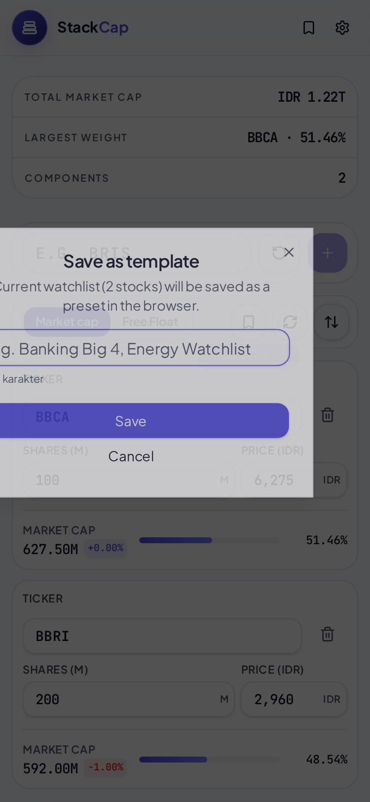
- 2-toast: 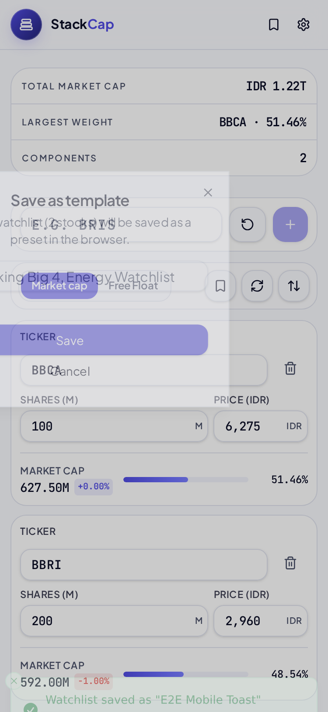
- 3-after-close: 
- 4-duplicate-toast: 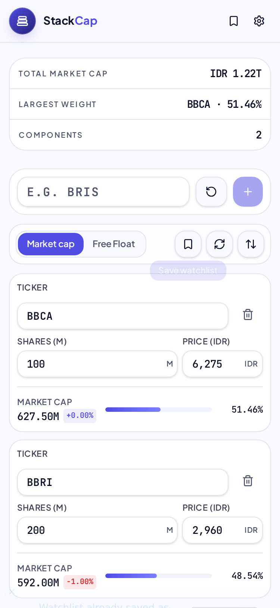

## mobile-dark ✅

| Check | Status | Detail |
| --- | --- | --- |
| Save button visible | ✅ | — |
| Save dialog opens on tap | ✅ | — |
| Success toast appears | ✅ | — |
| Toast text mentions saved template name | ✅ | Watchlist saved as "E2E Mobile Toast"2 stocks |
| Toast shows stock count matching watchlist | ✅ | expected 2 stocks — Watchlist saved as "E2E Mobile Toast"2 stocks |
| Toaster anchored bottom | ✅ | y=bottom x=center |
| Toast has close button | ✅ | — |
| Close button dismisses toast | ✅ | — |
| Duplicate save shows info toast | ✅ | Watchlist already saved as "E2E Mobile Toast"Save as new |
| Duplicate toast offers 'Save as new' | ✅ | Watchlist already saved as "E2E Mobile Toast"Save as new |

- 1-dialog: 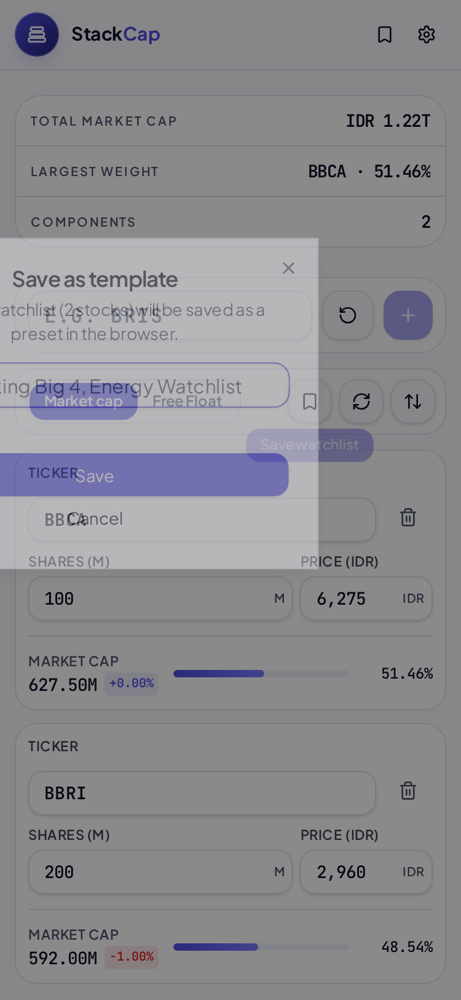
- 2-toast: 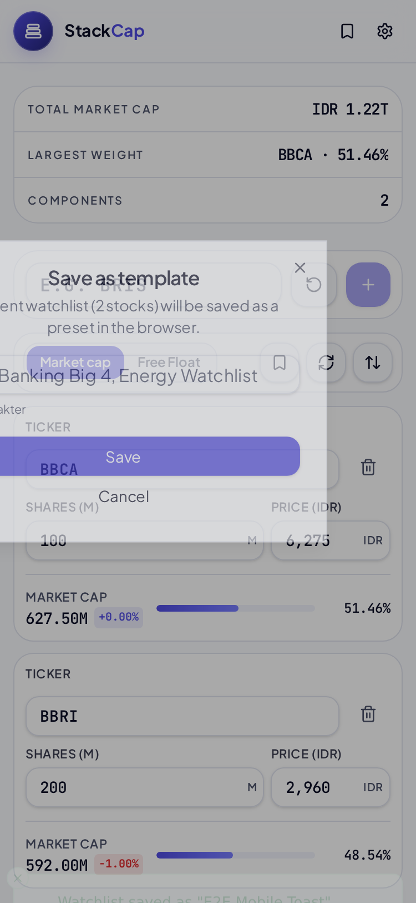
- 3-after-close: 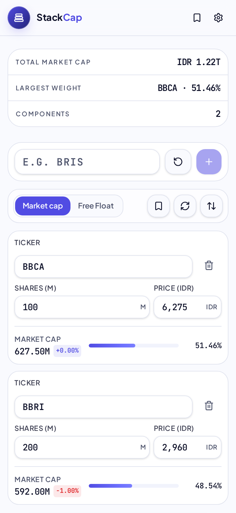
- 4-duplicate-toast: 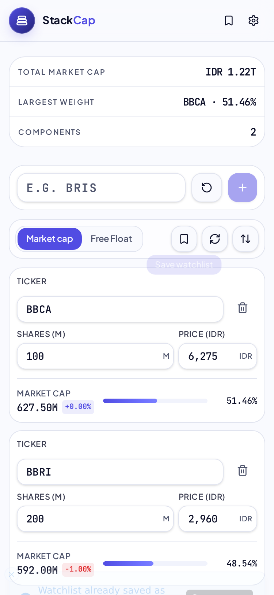

## mobile-xs-light ✅

| Check | Status | Detail |
| --- | --- | --- |
| Save button visible | ✅ | — |
| Save dialog opens on tap | ✅ | — |
| Success toast appears | ✅ | — |
| Toast text mentions saved template name | ✅ | Watchlist saved as "E2E Mobile Toast"2 stocks |
| Toast shows stock count matching watchlist | ✅ | expected 2 stocks — Watchlist saved as "E2E Mobile Toast"2 stocks |
| Toaster anchored bottom | ✅ | y=bottom x=center |
| Toast has close button | ✅ | — |
| Close button dismisses toast | ✅ | — |
| Duplicate save shows info toast | ✅ | Watchlist already saved as "E2E Mobile Toast"Save as new |
| Duplicate toast offers 'Save as new' | ✅ | Watchlist already saved as "E2E Mobile Toast"Save as new |

- 1-dialog: 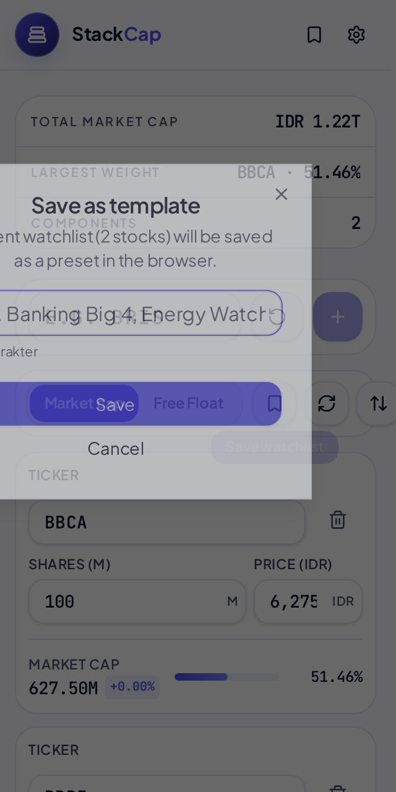
- 2-toast: 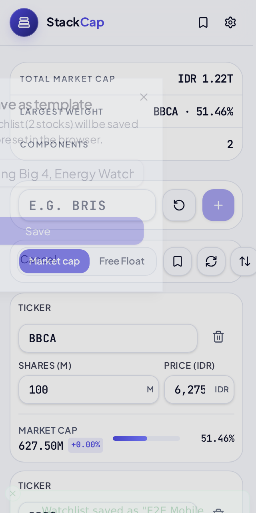
- 3-after-close: 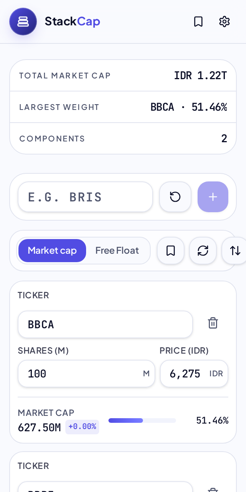
- 4-duplicate-toast: 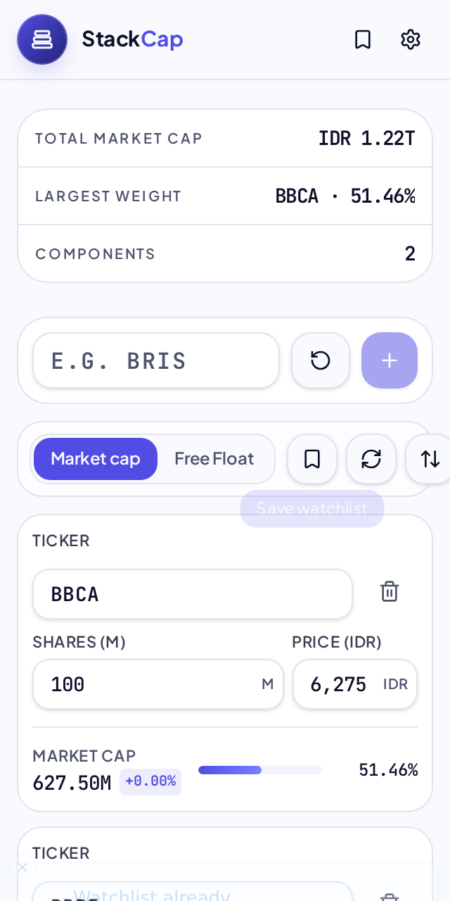
