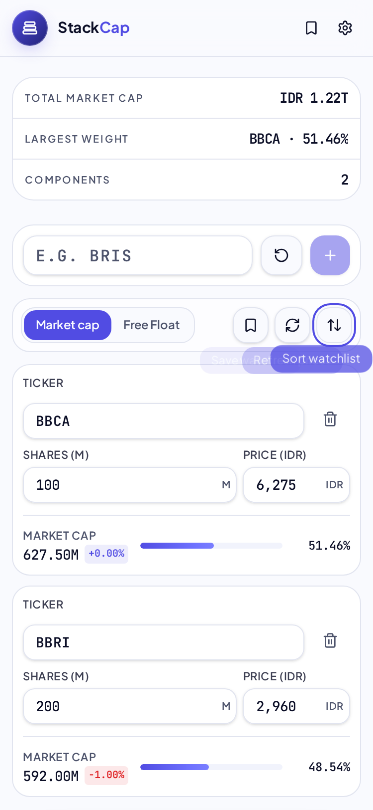
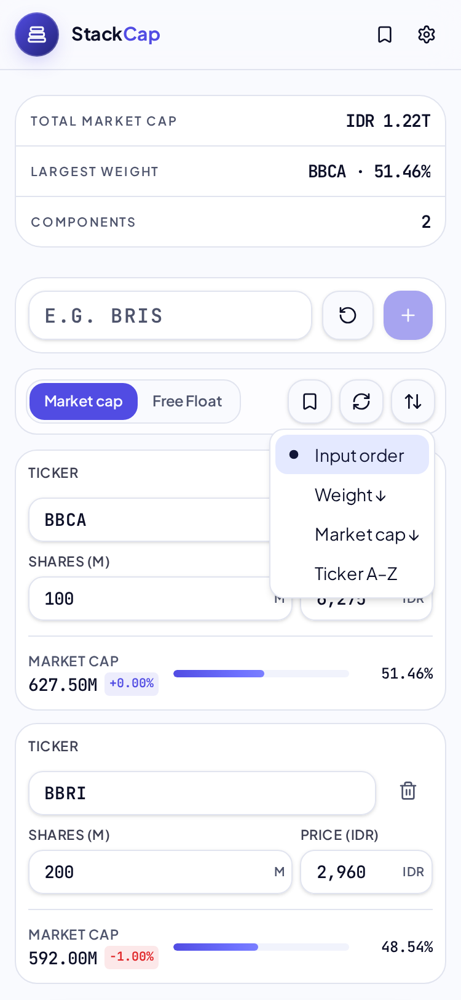
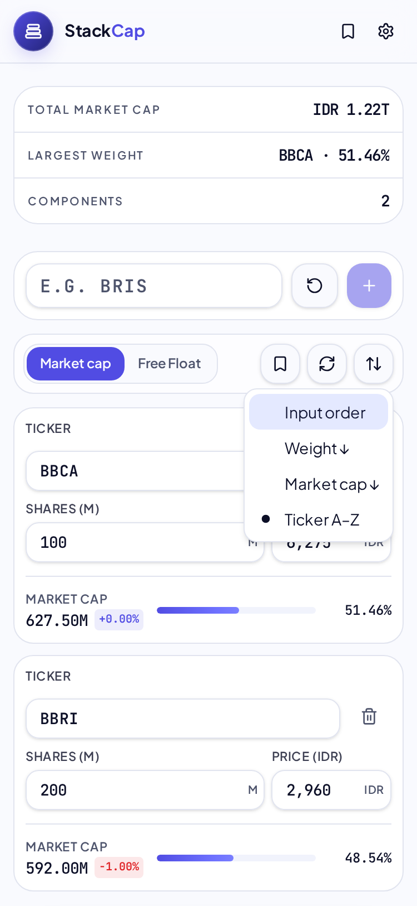
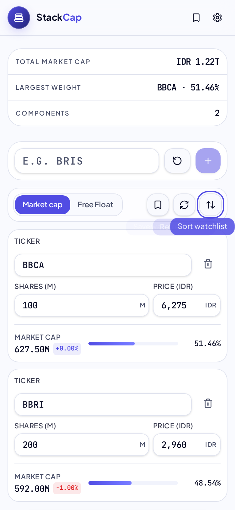
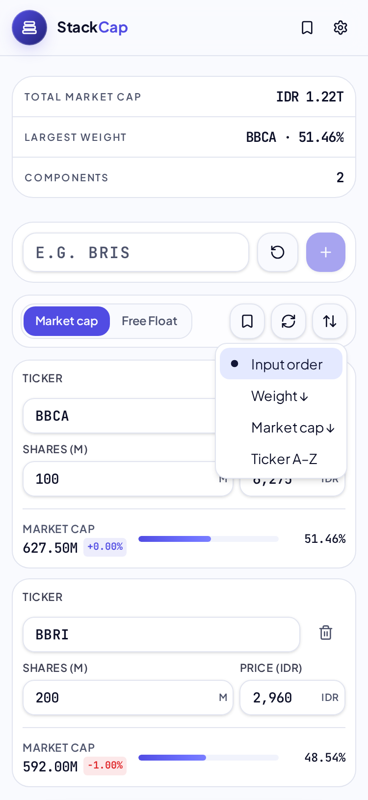
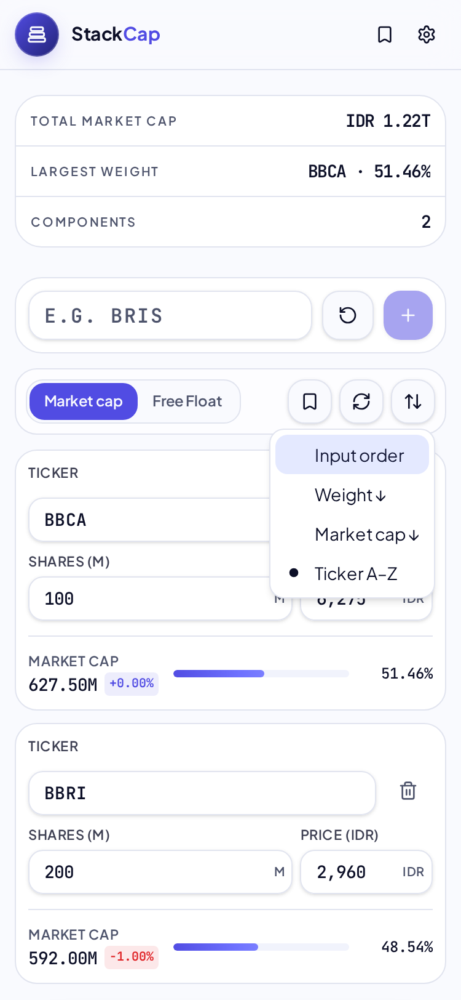
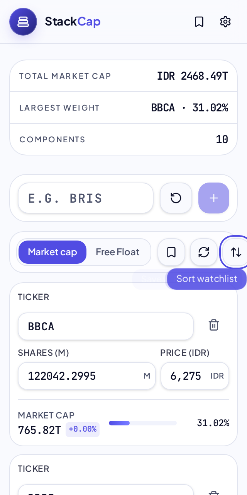
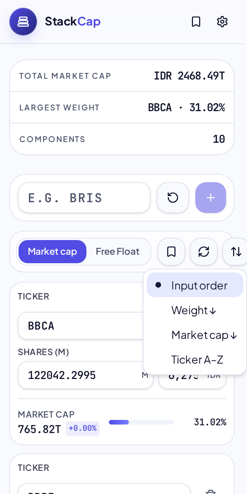
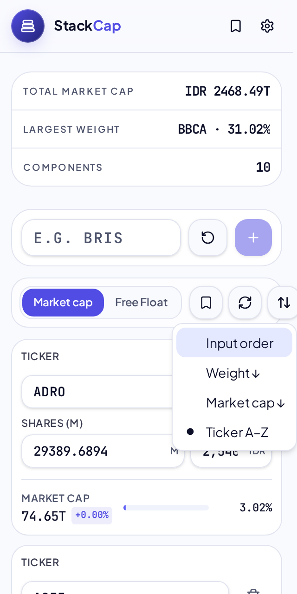

# Sort menu — mobile keyboard E2E

- Scenarios: 3
- Failing scenarios: **0**

## mobile-light ✅

| Check | Status | Detail |
| --- | --- | --- |
| Sort trigger visible | ✅ | — |
| Sort trigger reachable via Tab | ✅ | — |
| Trigger exposes aria-haspopup=menu | ✅ | menu |
| Trigger aria-expanded=false when closed | ✅ | — |
| Enter opens the Sort menu | ✅ | — |
| Trigger aria-expanded=true when open | ✅ | — |
| Menu renders all sort options | ✅ | Input order | Weight ↓ | Market cap ↓ | Ticker A–Z |
| Focus lands on a menu item when opened | ✅ | {"tag":"div","role":"menuitemradio","label":null,"text":"Input order","checked":"true"} |
| Focused item on open is the checked option | ✅ | focused="Input order" checked=true |
| ArrowDown moves focus to next item | ✅ | Input order -> Weight ↓ |
| ArrowUp returns focus to previous item | ✅ | Weight ↓ -> Input order |
| End focuses the last item | ✅ | Ticker A–Z |
| Home focuses the first item | ✅ | Input order |
| Escape closes the menu | ✅ | — |
| Focus returns to trigger after Escape | ✅ | — |
| Enter selects the focused item and closes the menu | ✅ | selected=Ticker A–Z |
| Focus returns to trigger after selection | ✅ | — |
| Selected sort option persists as checked | ✅ | Ticker A–Z |

- 1-trigger-focused: 
- 2-menu-open: 
- 3-keyboard-nav: 
- 4-after-select: 

## mobile-dark ✅

| Check | Status | Detail |
| --- | --- | --- |
| Sort trigger visible | ✅ | — |
| Sort trigger reachable via Tab | ✅ | — |
| Trigger exposes aria-haspopup=menu | ✅ | menu |
| Trigger aria-expanded=false when closed | ✅ | — |
| Enter opens the Sort menu | ✅ | — |
| Trigger aria-expanded=true when open | ✅ | — |
| Menu renders all sort options | ✅ | Input order | Weight ↓ | Market cap ↓ | Ticker A–Z |
| Focus lands on a menu item when opened | ✅ | {"tag":"div","role":"menuitemradio","label":null,"text":"Input order","checked":"true"} |
| Focused item on open is the checked option | ✅ | focused="Input order" checked=true |
| ArrowDown moves focus to next item | ✅ | Input order -> Weight ↓ |
| ArrowUp returns focus to previous item | ✅ | Weight ↓ -> Input order |
| End focuses the last item | ✅ | Ticker A–Z |
| Home focuses the first item | ✅ | Input order |
| Escape closes the menu | ✅ | — |
| Focus returns to trigger after Escape | ✅ | — |
| Enter selects the focused item and closes the menu | ✅ | selected=Ticker A–Z |
| Focus returns to trigger after selection | ✅ | — |
| Selected sort option persists as checked | ✅ | Ticker A–Z |

- 1-trigger-focused: 
- 2-menu-open: 
- 3-keyboard-nav: 
- 4-after-select: 

## mobile-xs-light ✅

| Check | Status | Detail |
| --- | --- | --- |
| Sort trigger visible | ✅ | — |
| Sort trigger reachable via Tab | ✅ | — |
| Trigger exposes aria-haspopup=menu | ✅ | menu |
| Trigger aria-expanded=false when closed | ✅ | — |
| Enter opens the Sort menu | ✅ | — |
| Trigger aria-expanded=true when open | ✅ | — |
| Menu renders all sort options | ✅ | Input order | Weight ↓ | Market cap ↓ | Ticker A–Z |
| Focus lands on a menu item when opened | ✅ | {"tag":"div","role":"menuitemradio","label":null,"text":"Input order","checked":"true"} |
| Focused item on open is the checked option | ✅ | focused="Input order" checked=true |
| ArrowDown moves focus to next item | ✅ | Input order -> Weight ↓ |
| ArrowUp returns focus to previous item | ✅ | Weight ↓ -> Input order |
| End focuses the last item | ✅ | Ticker A–Z |
| Home focuses the first item | ✅ | Input order |
| Escape closes the menu | ✅ | — |
| Focus returns to trigger after Escape | ✅ | — |
| Enter selects the focused item and closes the menu | ✅ | selected=Ticker A–Z |
| Focus returns to trigger after selection | ✅ | — |
| Selected sort option persists as checked | ✅ | Ticker A–Z |

- 1-trigger-focused: 
- 2-menu-open: 
- 3-keyboard-nav: 
- 4-after-select: 
